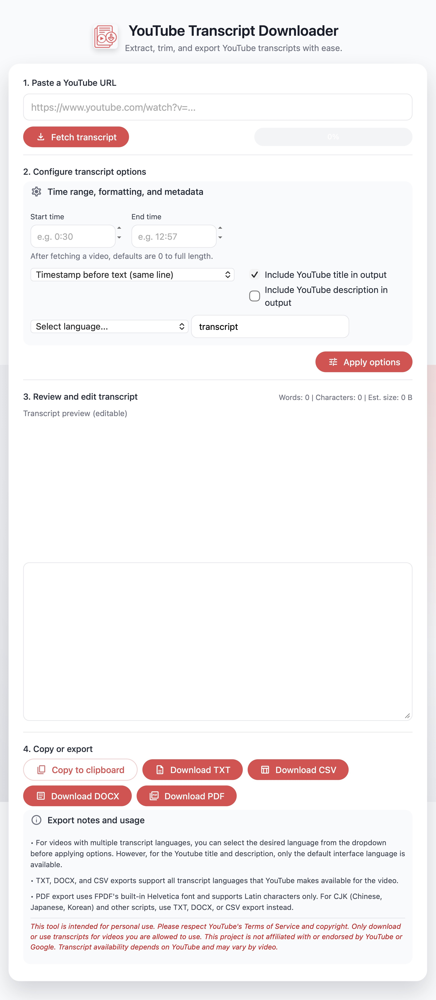

# YouTube Transcript Downloader

A web application for extracting, trimming, and exporting YouTube video transcripts in multiple formats (TXT, CSV, DOCX, PDF).



## Features

- Extract transcripts from any YouTube video with available captions
- Support for multiple transcript languages (including auto-generated)
- Trim transcripts by time range (start/end timestamps)
- Multiple display modes:
  - Timestamps on separate lines
  - Timestamps before/after text
  - Plain text (no timestamps)
- Optional inclusion of video title and description
- Export formats: TXT, CSV, DOCX, PDF
- Real-time preview with word/character count and file size estimation

## Running Locally (Recommended)

### Prerequisites

- Python 3.9 or higher
- pip (Python package manager)

### Installation

1. Clone the repository:
```bash
git clone <your-repo-url>
cd yt-transcript-downloader
```

2. Create and activate a virtual environment:
```bash
# On macOS/Linux
python3 -m venv venv
source venv/bin/activate

# On Windows
python -m venv venv
venv\Scripts\activate
```

3. Install dependencies:
```bash
pip install -r requirements.txt
```

### Running the Application

```bash
python main.py
```

The application will be available at http://localhost:8000

Press `Ctrl+C` to stop the server.

## Vercel Deployment

This project includes Vercel deployment configuration files ([vercel.json](vercel.json), [api/index.py](api/index.py), `public/` directory) for serverless deployment.

### ⚠️ Important Deployment Constraint

**YouTube blocks requests from cloud provider IPs (AWS, Google Cloud, Azure, Vercel, etc.)** to prevent bot scraping. This means:

- ✅ The app **works perfectly when run locally**
- ❌ The app **will fail on Vercel** with "YouTube is blocking requests from your IP" errors in the logs

### Why Keep Vercel Config?

The Vercel configuration files are kept in this repository because:
1. The deployment works technically (FastAPI serves correctly on Vercel)
2. It demonstrates a working Vercel + FastAPI setup
3. It can be reused for future projects that don't have IP blocking constraints
4. You can use it with proxy workarounds (see below)

### Deployment Files

- `vercel.json` - Vercel routing configuration
- `api/index.py` - Serverless function entry point
- `public/` - Static files (CSS, JS, images) served by Vercel
- `.vercelignore` - Files to exclude from deployment

### Workarounds for Cloud Deployment

If you want to deploy to Vercel despite the YouTube IP blocking, you have two options:

#### Option 1: Use Proxies (Recommended)

Configure proxy support in the YouTube Transcript API. See the [official documentation](https://github.com/jdepoix/youtube-transcript-api#working-around-ip-bans).

1. Add proxy configuration to `youtube_metadata.py` and `main.py`
2. Set up proxy rotation service
3. Configure proxy credentials via environment variables

#### Option 2: Use YouTube Data API (Official)

Switch to YouTube's official Data API:
- Requires API key from Google Cloud Console
- Has daily quota limits (10,000 units/day for free tier)
- May not provide the same transcript access
- More reliable for production use

## Project Structure

```
yt-transcript-downloader/
├── main.py                 # FastAPI application entry point
├── transcript_utils.py     # Transcript processing utilities
├── youtube_metadata.py     # YouTube metadata fetching
├── requirements.txt        # Python dependencies
├── templates/
│   └── index.html         # Main web interface
├── static/
│   ├── css/
│   │   └── styles.css     # Styling (local dev)
│   └── js/
│       └── app.js         # Frontend logic (local dev)
├── images/
│   └── icon.png           # App icon (local dev)
├── public/                # Static files for Vercel
│   ├── static/
│   └── images/
├── api/
│   └── index.py          # Vercel serverless entry point
└── vercel.json           # Vercel deployment config
```

## Technology Stack

- **Backend**: FastAPI (Python)
- **Frontend**: Vanilla JavaScript, HTML, CSS
- **Transcript API**: [youtube-transcript-api](https://github.com/jdepoix/youtube-transcript-api)
- **Deployment**: Vercel (serverless functions)

## Export Format Notes

- **TXT, DOCX, CSV**: Support all languages and characters
- **PDF**: Uses FPDF's built-in Helvetica font
  - Supports Latin characters only
  - For CJK (Chinese, Japanese, Korean) and other scripts, use TXT, DOCX, or CSV instead

## Limitations

1. **YouTube IP Blocking**: Cloud deployments (Vercel, AWS, etc.) are blocked by YouTube
2. **Transcript Availability**: Only works with videos that have available transcripts (manual or auto-generated)
3. **YouTube's Terms of Service**: This tool is for personal use only. Respect YouTube's ToS and copyright
4. **Rate Limiting**: YouTube may rate-limit requests even from local IPs if overused

## Troubleshooting

### "YouTube is blocking requests from your IP"

**If on Vercel**: This is expected. Use the app locally instead.

**If running locally**:
- You may have made too many requests in a short time
- Wait a few hours and try again
- Consider implementing request delays
- Use proxies (see Workarounds section above)

### "Could not retrieve a transcript"

- The video may not have available transcripts
- The video may be private or deleted
- The video may be region-restricted

### Static files not loading locally

Make sure you're running from the project root directory:
```bash
python main.py  # From yt-transcript-downloader/ directory
```

### Import errors

Make sure your virtual environment is activated and dependencies are installed:
```bash
source venv/bin/activate  # or venv\Scripts\activate on Windows
pip install -r requirements.txt
```

## Development

### Running with auto-reload

```bash
uvicorn main:app --reload --host 0.0.0.0 --port 8000
```

### Testing locally before deployment

```bash
# Test the app
python main.py

# Verify all routes work
curl http://localhost:8000/
curl -X POST http://localhost:8000/api/fetch -H "Content-Type: application/json" -d '{"url":"https://www.youtube.com/watch?v=dQw4w9WgXcQ"}'
```

## Removing Vercel Deployment

If you've deployed to Vercel and want to remove it while keeping the config files:

```bash
# Using Vercel CLI
vercel remove yt-transcript-downloader

# Or visit: https://vercel.com/dashboard
# Select your project → Settings → Advanced → Delete Project
```

The deployment will be removed but all config files (vercel.json, api/, public/) remain in your repository for future use.

## License

See [LICENSE](LICENSE) file.

## Disclaimer

This tool is intended for personal use only. Please respect YouTube's Terms of Service and copyright laws. Only download or use transcripts for videos you are allowed to use. This project is not affiliated with or endorsed by YouTube or Google.

Transcript availability depends on YouTube and may vary by video.
